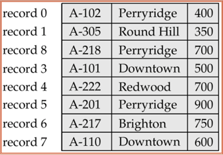
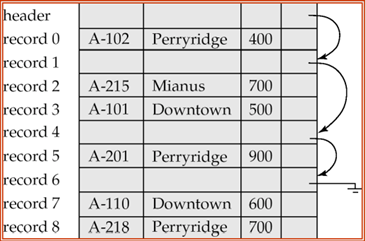
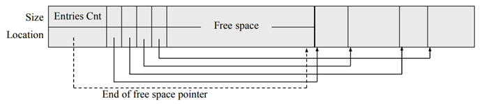

# File Organization
- Base de datos es colección de archivos
- Archivo -> secuencia de registros
- Registro -> secuencia de campos
## Conceptos
- Field: atributo o columna define cantidad de bytes
- Record: fila
- File: tabla
  - Texto: numero como chars
  - Binarios: numeros como binarios
- File Organization: 
  - Archivo lógico: registros modo tabla
  - Archivo físico registros en disco
- Key: identificador único
- Page: bloque que se transfiere entre memoria y disco para leer o escribir
- Index: puntero a registro en archivo
- Read: leer registro
- Write: escrbir nuevos registros
- Delete: borrar registros
## Organización de registros en un Archivo
### Fixed Length Records
Todos los registros tienen el mismo tamaño y mismo número de campos. Facil ubicación de registros.

#### Eliminación
- Eliminar el registro i: 
  - Implica mover todos los registros siguientes
  
- Free list: 
  - header alamcena puntero al primer registro eliminado
  - primer registro eliminado almacena puntero al siguiente registro
  - eliminado y así sucesivamente
  - Se puede usar para insertar nuevos registros
   
  - FIFO:
    - Eliminación ``O(n)``
    - Insertar ``O(1)``
  - LIFO:
    - Eliminación ``O(1)``
    - Insertar ``O(1)``
#### Problemas: 
- riesgo de cruzar bloques
- no permite cruzar el límite del bloque
### Variable Length Records
- Cada registro tiene un tamaño diferente (VARCHAR, TEXT, etc)
- Más eficiente en espacio primario y secundario
- Se guarda el separador que puede ser la longitud del campo o un caracter
  - caracter especial:
    - no puden aparecer en ningun lugar
    - requiere explorar todo el archivo para encontrar el separador
    - acceso directo a un registro ``O(n)``
    - eliminar un registro ``O(n)``
  - Separador de longitud:
    - se guarda la longitud del campo
    - se puede acceder directamente
    - eliminar un registro ``O(n)``
    - acceso directo a un registro ``O(n)``
  - Slotted Page
    - 
    - Header indica el inicio de cada registro
    - Hay que mantener actualizado el encabezado
    - se verigica el heaader para acceder a un registro 
    - Tiene acceso directo a un registro 
## Empaquetando Registros en Bloques
- 2 Casos en la relazión registro-bloque
  - registro < bloque
    - caso más común
    - max numero de registros por bloque:
    - **bloquin factor** = floor(tam_bloque/tam_registro)
  - registro > bloque
    - se usa spanned organization
    - un registro abarca diferentes bloques
    - se usa una secuencia de bloques
    - Tambien se puede usar para no dejar espacios vacios en el bloque
## Tipos de Búsqueda
- devuelve todos los registros
```c++
Record[] scannAll();
```
- devolver dada posición lógica
```c++
Record search(int pos);
```
- devolver dada clave
```c++
Record search(Key k);
```
## Métodos de organización de archivos
Depende de los medios de almacenamiento, 
### Heap File Organization
- registros almacenados en ubicaciones adyacentes conformen llegan
- no mantiene orden físico
- usos
  - archivos transacciones, orden cronologico y se recuperan inversmente
  - complementarios
- Insersiones ``O(1)``
- Acceso ``O(n)``
### Sequential File Organization
Busquedas eficientes, insersiones y eliminaciones ineficientes por localizacion, reorganización de archivo.
Se puede utilziar un AVL
- registros ordenados por clave
- si no estan fisicamente ordenados se usa un indice
- Insersion ``O(n)``
  - localizar la posicion, si está libre insertar, sino insertar en auxiliar, actualizar los punteros
  - requere reorganizar cada cierto tiempo
- Busqueda ``O(log(n))``
  - Con busqueda binaria
- Eliminación ``O(n)``
  - Se utiliza los punteros para skipear tuplas eliminadas
  - Se puede utiizar marcadores para reutilizar
### Random File Organization
- registros no estan ordenados fisicamente
- diccionario que relaciona keys y posiciones
### Indexed Sequential File Organization