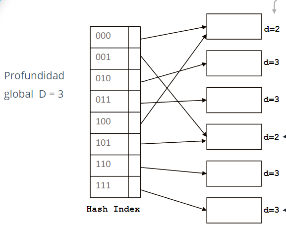
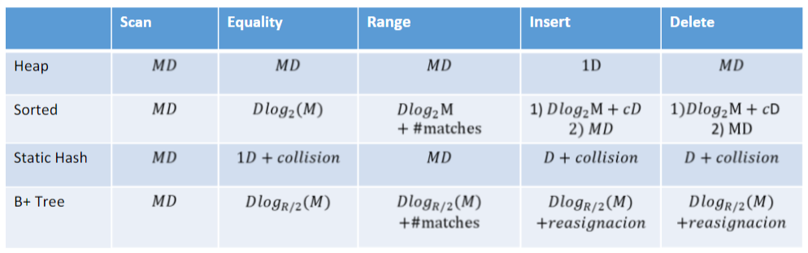

# Resumen Ejecutivo

- [Resumen Ejecutivo](#resumen-ejecutivo)
- [File Organization](#file-organization)
  - [Conceptos](#conceptos)
  - [Organización de registros en un Archivo](#organización-de-registros-en-un-archivo)
    - [Fixed Length Records](#fixed-length-records)
      - [Eliminación](#eliminación)
      - [Problemas:](#problemas)
    - [Variable Length Records](#variable-length-records)
  - [Empaquetando Registros en Bloques](#empaquetando-registros-en-bloques)
  - [Tipos de Búsqueda](#tipos-de-búsqueda)
  - [Métodos de organización de archivos](#métodos-de-organización-de-archivos)
    - [Heap File Organization](#heap-file-organization)
    - [Sequential File Organization](#sequential-file-organization)
    - [Random File Organization](#random-file-organization)
    - [Indexed Sequential File Organization (acces method)](#indexed-sequential-file-organization-acces-method)
  - [Estructuras de indexación de archivos](#estructuras-de-indexación-de-archivos)
    - [Hash-based Index](#hash-based-index)
    - [B+Tree Index](#btree-index)
    - [Costos](#costos)


# File Organization
- Base de datos es colección de archivos
- Archivo -> secuencia de registros
- Registro -> secuencia de campos
## Conceptos
- Field: atributo o columna define cantidad de bytes
- Record: fila
- File: tabla
  - Texto: numero como chars
  - Binarios: numeros como binarios
- File Organization: 
  - Archivo lógico: registros modo tabla
  - Archivo físico registros en disco
- Key: identificador único
- Page: bloque que se transfiere entre memoria y disco para leer o escribir
- Index: puntero a registro en archivo
- Read: leer registro
- Write: escrbir nuevos registros
- Delete: borrar registros
## Organización de registros en un Archivo
### Fixed Length Records
Todos los registros tienen el mismo tamaño y mismo número de campos. Facil ubicación de registros.

#### Eliminación
- Eliminar el registro i: 
  - Implica mover todos los registros siguientes
  
- Free list: 
  - header alamcena puntero al primer registro eliminado
  - primer registro eliminado almacena puntero al siguiente registro
  - eliminado y así sucesivamente
  - Se puede usar para insertar nuevos registros
   
  - FIFO:
    - Eliminación ``O(n)``
    - Insertar ``O(1)``
  - LIFO:
    - Eliminación ``O(1)``
    - Insertar ``O(1)``
#### Problemas: 
- riesgo de cruzar bloques
- no permite cruzar el límite del bloque
### Variable Length Records
- Cada registro tiene un tamaño diferente (VARCHAR, TEXT, etc)
- Más eficiente en espacio primario y secundario
- Se guarda el separador que puede ser la longitud del campo o un caracter
  - caracter especial:
    - no puden aparecer en ningun lugar
    - requiere explorar todo el archivo para encontrar el separador
    - acceso directo a un registro ``O(n)``
    - eliminar un registro ``O(n)``
  - Separador de longitud:
    - se guarda la longitud del campo
    - se puede acceder directamente
    - eliminar un registro ``O(n)``
    - acceso directo a un registro ``O(n)``
  - Slotted Page
    - 
    - Header indica el inicio de cada registro
    - Hay que mantener actualizado el encabezado
    - se verigica el heaader para acceder a un registro 
    - Tiene acceso directo a un registro 
## Empaquetando Registros en Bloques
- 2 Casos en la relazión registro-bloque
  - registro < bloque
    - caso más común
    - max numero de registros por bloque:
    - **bloquin factor** = floor(tam_bloque/tam_registro)
  - registro > bloque
    - se usa spanned organization
    - un registro abarca diferentes bloques
    - se usa una secuencia de bloques
    - Tambien se puede usar para no dejar espacios vacios en el bloque
## Tipos de Búsqueda
- devuelve todos los registros
```c++
Record[] scannAll();
```
- devolver dada posición lógica
```c++
Record search(int pos);
```
- devolver dada clave
```c++
Record search(Key k);
```
## Métodos de organización de archivos
Depende de los medios de almacenamiento, 
### Heap File Organization
- registros almacenados en ubicaciones adyacentes conformen llegan
- no mantiene orden físico
- usos
  - archivos transacciones, orden cronologico y se recuperan inversmente
  - complementarios
- Insersiones ``O(1)``
- Acceso ``O(n)``
### Sequential File Organization
Busquedas eficientes, insersiones y eliminaciones ineficientes por localizacion, reorganización de archivo.
Se puede utilziar un AVL
- registros ordenados por clave
- si no estan fisicamente ordenados se usa un indice
- Insersion ``O(n)``
  - localizar la posicion, si está libre insertar, sino insertar en auxiliar, actualizar los punteros
  - requere reorganizar cada cierto tiempo
- Busqueda ``O(log(n))``
  - Con busqueda binaria
- Eliminación ``O(n)``
  - Se utiliza los punteros para skipear tuplas eliminadas
  - Se puede utiizar marcadores para reutilizar
### Random File Organization
- registros no estan ordenados fisicamente
- diccionario que relaciona keys y posiciones
- se usa key para acceder a registros (hashing)
- insercion ``O(1)``
- busqueda ``O(1)`` 
- se necesita mas espacio
- pueden haber colisiones
### Indexed Sequential File Organization (acces method)
- combina random y sequential
- Busquedas eficientes ``O(log(n))``
- Insersiones y eliminaciones eficientes
- extendible para multikey
- espacio extra para index-file
- se va elevado la complejidad del indice
- Usa 2 archivos
  - Index file: guarda key con punteros a registros (página)
  - Data file: guarda registros
- Tipos
  - Dense Index: cada registro tiene un puntero
  - Sparse Index: cada page tiene un puntero
    - Se suele aplicar cuando los datos ya están ordenados
    - Mas lento que el dense index
    - Menos espacio y menos costo de mantenimiento
    - el key corresponde al menor valor de clave de la página
  - Multilvel index-file:
    - se usa cuando el index file es muy grande
    - inserciones y eliminaciones actualizan los indices
    - busqueda por niveles de indexación
    - Pueden haber overflow pages
    - Cost = log F N
    - F = # entries/pg
    - N = # leaf pgs
## Estructuras de indexación de archivos
### Hash-based Index
- Componentes:
  - Hash function: calcula el hash de la key
  - Hash Index: espacio de valores hash y punteros a paginas
  - Bucket/Página: donde se almacenan varios datos
- Tipos
  - Static Hashing
    - Division-resto: h(k) = k mod m
    - Plegable: h(k) = sum(digitos(k)) mod m
    - Manejo de overflow, con punteros a overflow buckets
    - Inserción: asignas a bucket, creas overflow si necesario
    - Eliminación: localizas eliminas del main o overflow, traes un elemento del overflow si es necesario
    - busqueda: acceso directo al bucket y busqueda secuencial
    - La cantidad de buckets son fijos
  - Extendible Hashing
  
    - Ideal para bases transaccionales
    - funcion hash genera secuencia de bits
    - se usa prefijo de bits para direccionar buckets
    - Depende de la profundida, se hashe y se busca el bucket de esa profundidad
    - Inserción: se calcula el hash, se busca el bucket, si no hay espacio se aumenta la profundidad, se divide el bucket, se reasignan los elementos. Si no hay mas profundidad, se usa overflow
    - Eliminación: se busca el bucket, se elimina el elemento, si dos buckets tienen poco elementos, se mezclan y se disminuye la profundidad
    - No se pierde performance con el cambio de tamaño
    - minizima cantidad de overflow
    - puede ocupar mucho espacio en memoria el indice
    - cambar el tamaño del indice es costoso
    - no soporta busquedas por rangos
  - Linear Hashing
### B+Tree Index 
- Indice multinivel arbol B+
- hojas referencia a registros y se enlazan entre si (mismo que nodo interno)
- nodos internos no tienen registros (n/2 a n)
- nodos siempre estan llenos al menos hasta la mitad
- tipos
  - unclustered index
    - hojas son indices densos
  - clustered index
    - hojas son indices dispersos (busqueda lineal)
    - se tienen los datos ordenados con espacio libre entre paginas
    - se puden hacer paginas de desbordamiento
- Se reorganiza automaticamente cuando se inserta o elimina
- no requiere reorganizacion completa
- busqueda secuencial y por rango
- demasiados bloques de desbordamiento
- Inserción:
  - se busca la hoja pertinente
  - si la clave ya esta en la hoja, agregar al archivo de datos
  - si la clave no està en la hoja, se agrega la clave y el puntero al archivo de datos
  - dividir el nodo si es necesario
- Eliminaciòn
  - se busca la hjoa pertinente
  - remover el puntero y clave de la hoja
  - redistribuir con hermanos si es necesario o combinar
  - actualizar la clave si es necesario
  - puden hacer cascada
  - busqueda log_{r/2}(M)
  - inserciones y eliminaciones: busqueda + split * n_desbordados

### Costos
  
