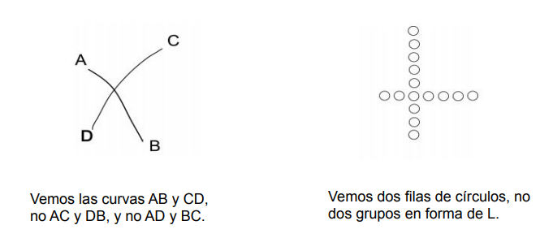
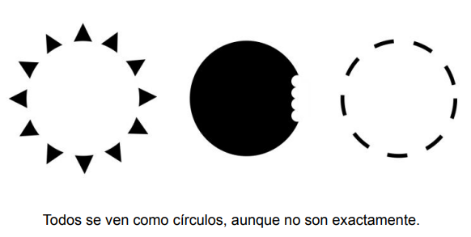

# Resumen magistral
  

## Que es IHC?
- Disciplina que estudia diseño, implementación y evaluación de sistemas interactivos para uso humano
## Factores humanos
- machine state -> pantallas -> sensores
- cerebro -> responders -> controls -> machine state
- sensores humanos:
  - touch
  - smell
  - taste
- responders
  - ojos
  - pies
  - cuerpo
  - cara
  - lengua
## Intefaces de usuario
- tipos:
  - pantallas
  - gestos
  - voz
  - dispositivo
  - mecanismos
- Ejemplos:
  - Lampara
    - funcion: iluminar
    - interfaz: boton
    - parte funcional: bombilla
    - interaccion: presione on o off
    - tareas del usuario: encender o apagar
## Deciplinas relacionadas
- Ciencias de la computación
- Ingeniría
- Psicología
- Lingüística, AI
- Ergonomía
- Sociología
- Practicas de diseño:
  - grafico
  - de producto
  - industrial
  - cinematográfica 
## Terminología:
- CHI: Computer-Human Interaction
- HCI: Human-Computer Interaction
- UCD: User-Centered Design
- MMI: Man Machine Interface
- HMI: Human Machine Interface
- OMI: Operator-machine interface
- UID: User Interface Design
- HF: Human Factors
## Importancias
- las coputadoras son usadas por personas no tecincas, por lo que se debe tener en cuenta la experiencia del usuario y de facil uso.
- Se debe buscar:
  - diseñar progrmas interactivos
  - manejar dispositvos complejos
  - optimizar el tiempo
  - minimizar errores
## Alcances
- uso de computadoras
- como se espera que los humanos interactuen con las computadoras
- arquitercturas de interfases limitan los tipos de interfaces que pueden ser creadas
- analziza: diseño, implemtacion y evaluacion de interfaces
## Objetivos
- Comprednder factores determinantes el uso de la tecnologia
- selecionar dispositivos io correctos
- determinar mejor forma de intraccon
- desarrolla y mejorar
  - Seguridad
  - Utilidadad
  - Efectividad
  - Eficiencia
  - Usabilidad
  - Apelación 
## Cargos
- Diseñador de interacción
- Ingeniero de usabilidad
- Diseñadores web
- Arquitectos de la información
- Diseñadores de experiencia de usuario
## Historia
- 1945: Vannevar Bush. consejero de roosevelt
- 1945: proponia en "Como podríamos pensar" un dispositivo llamado Memex
- 1962: Ivan Sutherland. Sketchpad. manipulacion de objetos en pantalla con un lapiz
- 1963: mouse
- 1981: Xerox Star. Primera interfaz grafica
- 1983: sugiroo trabajo realizado en Xerox PARC
- 1984: Apple Macintosh popularizo el uso de ventanas
## Principios generales
### Compativiidad:
- usuario
  - El sistema debe ser compatible con las capacidades y limitaciones de los usuarios
  - Los usuarios son diferentes
  - Los usuarios no piensan como el desarrollador
- producto
  - reducir tiempo de aprendizaje
  - reducir errores
  - existen habitos de productos anteriores
- tareas
  - organizacion debe coincidir con las tareas del usuario
- flujo de trabajo
  - facil transicion entre tareas
  - no debe verse obligado a cambiar de contexto
### Facilidad de aprendizaje
- debe ser facil de aprender
### Memorabilidad
- incrementa facilidad de aprender y usu
- Ubicación: colocacion de objetos consistente
- Agrupación lógica: agrupar objetos relacionados
- Convenciones: simbolos convencionales
### Previsivilidad
- capacidad de determinar el siguiente paso
- expectativas de una persona y su capacidad par determinar resultados
- coherecia: refuerza asociaciones aumenta capacidad de predecir y recordar
- generalizabilidad: aplicar conocimiento previo a nuevas situaciones
- familiaridad: conocimiento previo de un sistema
### Sencillez
- divulgacion profresiva, no saturar al usuario
### Flexibilidad
- permitir diferentes opciones a los usuarios
  - hardware
  - tipos de interaccion
  - formato de datos
- rapida respueta
- reconocer las acciones del usuario
- proteger a los usuarios contra errores
## Diseño deficientes
- dificiles de utilizar
- frustran
- no dan pistas
- pistas falsas
- inducen error
## Visibilidad 
- partes deben:
  - ser visibles
  - transportar mensaje correcto
  - dar señales naturales
  - proveer una estructura visible
## Affordances
- Propiedades reales o percibidas
- determinan como puede ser usado
- responde ¿para que?
- proveer pistas
- control evitar falsa causalidad
## Modelo mental
- modelo que tienen las personas de los objetos que interactua
- se forman en base a la.
  - experiencia
  - formacion
  - capacitacion
  - interpretando las acciones eprcibidas
  - interactuando con el mundo
## Mapping
- relacion entre que se desea y que se puede hacer
- relacion entre control y funciones
- facil aprendido y recordado
- usa prinicpios de percepión
## Feedback
- retroalimentacion de la accion realizada 
- dar a cada accion una respuesta
- proveer pistas
## Error humano
- humanos se comportan torpemente
- no siempre cometen errores
- los cometen cuando se diseña mal
- se puede dar por fallas de equipo o errores de diseño
- si un error es posibile, sucederá
- errores deben ser faciles de detectar y tener consecuencias minimas
- deben ser reversibles
## Facotres humanos
- utilizamos
  - sentidos
  - experiencias pasadas
  - expectativas
## Modelo humano
- como procesamos la información
  - etapa 1: codificacion del entorno
  - etapa 2: compara representacion mental es comparada con la memoria
  - etapa 3: selecciona la respuesta
  - etapa 4: ejecuta la respuesta y acción
- Ampliación:
  - Atención:
    - selectiva: enfocarse en un estimulo
    - dividida: enfocarse en varios estimulos
  - Memoria:
    - sistema de percepcion: sensores y buffer de recuerdos
    - sistema cognitivo: memoria a corto y largo plazo
    - sistema motor: realiza la respuesta
## Sensores humanos
- Vista
  - recibe luz
  - refleja los objetos
  - se enfoca en la retina 
    - fovea: vision de color y patrones
    - parte exterior: sensible a la luz y movimiento
  - no se puede esperar se concentre en el medio y lea algo en la periferia
  - Constructivismo:
    - cerebro no crea pixeles
    - crea modelos de resumen de lo que percibe, el contexto importa
    - vemos detealles con significado
    - esto implica que todos los detalales de una interfaz no serán vistos
    - divide las imagenes en figura y fondo
  - psicologia Gestalt
    - Se perciben objetos agrupados como un grupo
    - se debe usar la proximidad para agrupar cosas relacionadas
    - Principio de continuidad: se perciben lineas continuas y no interrumpidas
    - 
          
    - Principio de cierre: se perciben objetos completos
          
  - Velocidad / precision de lectura
    - La forma de las palabras es importante para la lectura
    - Orden de escenas cambia contexto

# Cuarta clase

## Efecto Kuleshov
- El efecto Kuleshov es un fenómeno psicológico por el cual el significado de una película es alterado por la información que se le da al espectador.
- El orden de las imagenes afecta la percepcion del espectador

## Audición
- El sonido es una onda que se propaga en el aire
- El oido humano puede percibir sonidos entre 20Hz y 20kHz
### Propiedades del sonido
- Intensidad (decibeles)
- Frecuencia (hertz)
- Timbre (armónicos)
- Sonoridad

### Utilidad
- Notificación
- Inmersión
- Retroalimentación
- Conciencia espacial

## Tacto
- Se utiliza para percibir sensaciones como el dolor, la temperatura, la posición, la forma, la textura y la resistencia.
### Ejemplos
- Un botón que se siente suave y redondeado indica que es fácil de presionar.
- Una superficie rugosa puede indicar que algo es antideslizante o resistente al desgaste.
- Un objeto con una textura suave y sedosa puede transmitir una sensación de calidad o lujo.
- Un objeto con una superficie fría puede indicar que está hecho de metal o vidrio.

## Olfato y gusto
- Olfato: se utiliza para percibir olores (cavidad nasal)
- Gusto: recepción química de sensaciones dulces, saladas, amargas y ácidas
- Sabor: combinación de olor y gusto

## Inventario de Handedness de Edimburgo
- Se utiliza para determinar la lateralidad de una persona: si es diestro o zurdo

## Voz
- La voz es un sonido producido por las cuerdas vocales
### Tipos de sonidos vocalizados
- Discurso: información verbal
- No habla: información no verbal

## El cerebro
- El cerebro es el órgano más complejo del cuerpo humano
### Funciones
- Percepción: interpretación de los sentidos
- Cognición: procesamiento de información
- Memoria: almacenamiento de información

### Retos de medir la actividad cerebral
- Cuándo comienza y termina un proceso
- Dónde se mide
- Qué es lo que exactamente se está procesando
- La opración cognitiva viene después de un estímulo sensorial y antes de una respuesta motora

## Elementos de interacción
- Interacción: comunicación entre dos o más entidades. En este caso humano y computador.
- La interacción está motivada por una tarea que el computador puede ayudar a realizar.
- Existen tareas con un objetivo fijo y otras sin uno (como navegar, tontear)
### Tipos de controles
- Controles duros: dispositivos físicos de un solo propósito
- Controles suaves: dispositivos virtuales de múltiples propósitos

## Relación control pantalla
- También llamados mapeos. Esta relación se refiere al vínculo entre el funcionamiento de un control y el efecto creado en una pantalla.
### Tipos de mapeos
- Releaciones espaciales: cómo los controles en una pantalla están organizados en relación con los elementos visuales que representan
- Relaciones dinámicas: cómo los controles cambian en respuesta a las acciones del usuario o a cambios en el estado del sistema.
- Relaciones físicas: refieren a cómo los controles en una pantalla corresponden a dispositivos físicos externos, como un mouse o un teclado.
  

# Quinta clase

## Diseño centrado en el usuario
- Proceso iterativo
- Enfocado en usuarios y sus necesidades
- Involucra a los diseñadores y stakeholders
- Equipo multidisciplinario

### Actividades básicas
- Identificar necesidades y requerimientos
- Desarrollar soluciones alternativas
- Construir versiones interactivas
- Evaluar las alternativas

## Usabilidad
- Que tan facil es usar un sistema
### Componentes
- Capacidad de aprendizaje: que tan facil es por primera vez
- Eficiencia: que tan rapido se puede usar una vez aprendido
- Retención: que tan facil es recordar como usarlo
- Errores: que tan facil es cometer errores y recuperarse de ellos
- Satisfacción: que tan agradable es usarlo
### Utilidad vs Usabilidad vs UX
- Utilidad: que se puede lograr
- Usabilidad: que tan facil es lograrlo
- UX: que tan agradable es lograrlo
### 10 heurísticas de Nielsen
- Visibilidad del estado del sistema: mantener al tanto al usuario de lo que esta pasando
- Coincidencia entre el sistema y el mundo real: usar terminos familiares
- Control y libertad del usuario: permitir deshacer acciones
- Consistencia y estandar: seguir estandares
- Prevención de errores: evitar que el usuario cometa errores
- Reconocer en lugar de recordar: hacer que las cosas sean visibles
- Flexibilidad y eficiencia de uso: permitir que los usuarios expertos sean mas rapidos
- Diseño estetico y minimalista: no incluir informacion irrelevante
- Ayudar a los usuarios a reconocer, diagnosticar y recuperarse de los errores: mensajes de error claros
- Ayuda y documentacion: que sea facil de encontrar y enfocada en la tarea

## Prototipado
- Simular el comportamiento de un sistema
- Representación física de una idea
### Por que prototipar?
- Evaluar ideas
- Comunicar ideas
- Elegir entre alternativas
- Reducción de errores
- Reducción de costos
- Fomentar un producto final de calidad
- Acelerar el desarrollo
- Llevar a los usuarios al proceso en etapas tempranas
- Mayor satisfacción del usuario
### Tipos de prototipos
- Prototipos de baja fidelidad: dibujos, wireframes, papel
- Prototipos de alta fidelidad: prototipos funcionales, simulaciones, maquetas (el peligro es que se puede confundir con el producto final)
### Técnicas de prototipado
- Storyboards: secuencia de dibujos que representan una historia
- Basado en tarjeta: tarjetas que representan pantallas
